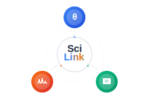
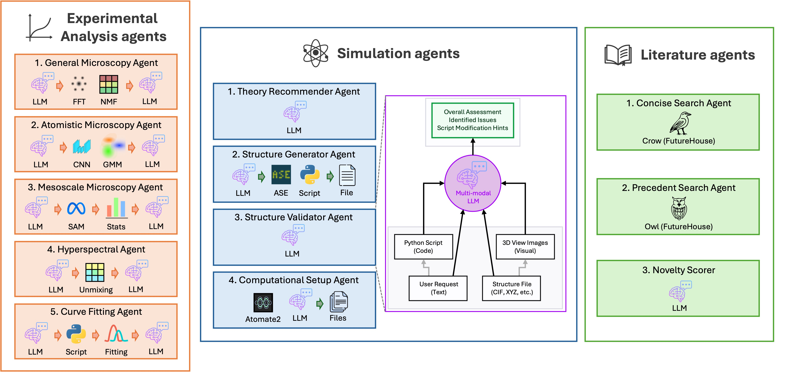
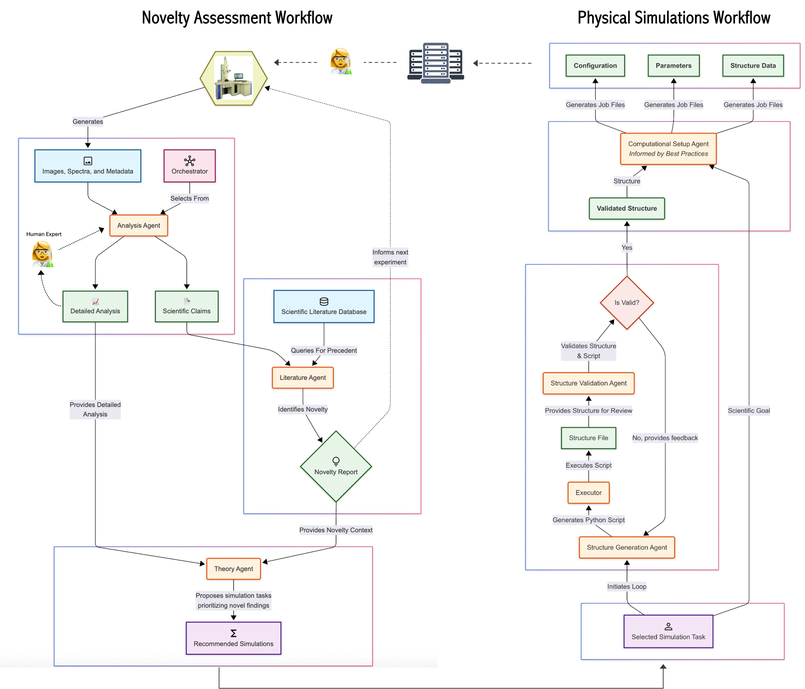

# SciLink

A Python framework for connecting experimental materials science with computational modeling and automated literature analysis using Large Language Models.



## Overview

SciLink employs a system of intelligent agents to automate the research cycle, from experimental observation to computational modeling. It streamlines the analysis of experimental data, assesses the novelty of findings against the scientific literature, and sets up DFT simulations to investigate those findings.

## Core Concepts

- 🤖 **Agent-Based Architecture**: The framework is built on a collection of specialized agents, each designed for a specific scientific task:

    - 🔬 **Experimental Agents**: Analyze microscopy images or spectroscopy data to extract features and generate scientific claims. An OrchestratorAgent automatically selects the best analysis tool for your data.

    - 📚 **Literature Agent**: Queries scientific databases (via FutureHouse's OWL) to validate claims and assess novelty with a nuanced scoring system.

    - ⚛️ **Simulation Agents**: Generate, validate, and refine atomic structures using ASE and specialized tools. They also create and validate VASP input files (INCAR, KPOINTS) against literature best practices.

- 🔄 **Automated Workflows**: High-level workflows chain these agents to perform complex tasks, from data analysis to simulation-ready files, with minimal user intervention.

- 🛡️ **Secure by Design**: AI-generated code for creating atomic structures is executed in a security sandbox (Docker, Colab, or VM) to protect your system. The tool will halt if a safe environment is not detected.

- 💻 **Local Model Support**: Choose between powerful cloud APIs or run experimental analysis agents entirely offline with local models, such as Gemma-3 series. This keeps your data on your machine, offering flexibility for privacy, cost, or offline work.

---
<br>





<br>

## Statement of Need

Have you ever run an experiment where you thought you had discovered something new, only to find out weeks or months later that it had already been reported five years ago? Or perhaps you've stared at a fascinating structure in your experimental images, wishing you could get a theorist's insight, but the thought of initiating a collaboration that might take months to even get going feels exhausting.

SciLink is designed to address those bottlenecks and close the gap between "I think I found something" and "I know what this is and what to do next." It accelerates the research lifecycle by:

- Converting raw experimental data into well-defined scientific claims, enabling immediate and effective literature searches.

- Instantly contextualizing experimental findings within the vast body of scientific literature, giving you a "novelty check" on the spot.

- Bridging the experiment-theory gap, automatically translating your experimental data into simulation-ready computational models.

- Reducing the time-to-insight from weeks and months to minutes and hours, enabling you to rapidly iterate on new ideas while your experiment is still running!

## Installation

### Standard Installation
```bash
pip install scilink
```

### Development Installation
```bash
git clone https://github.com/scilinkllm/scilink.git
cd scilink
pip install -e .[full]
```

## Quick Start

### 1. Configure API Keys

SciLink requires a Google API key for its generative AI capabilities. For literature features, a FutureHouse API key is needed.

```python
import scilink

# Configure required API keys
scilink.configure('google', 'your-google-api-key')
scilink.configure('futurehouse', 'your-futurehouse-key')  # Optional

# You can also set them as environment variables:
# export GOOGLE_API_KEY="your-key"
# export FUTUREHOUSE_API_KEY="your-key"
```

### 2. Novelty Assessment Workflow

Analyze an experimental image, generate scientific claims, and check them against the literature.

```python
from scilink.workflows import ExperimentNoveltyAssessment

# Create the workflow for microscopy data
# The agent_id will be chosen automatically by the OrchestratorAgent
workflow = ExperimentNoveltyAssessment(data_type="microscopy", output_dir="novelty_analysis")

# Run the complete analysis
result = workflow.run_complete_workflow(
    data_path="path/to/your/stem_image.tif",
    system_info={"material": "MoS2", "technique": "HAADF-STEM"}
)

print(f"Workflow Status: {result['final_status']}")
if result['final_status'] == 'success':
    print(f"Average Novelty Score: {result['novelty_assessment']['average_novelty_score']:.2f}/5.0")
    print(f"Potentially Novel Findings: {len(result['novelty_assessment']['potentially_novel'])}")
```

### 3. DFT Structure Generation Workflow

Generate a validated atomic structure and VASP inputs from a simple text description.

```python
from scilink.workflows import DFTWorkflow

# Create the DFT workflow
dft_workflow = DFTWorkflow(output_dir="dft_si_defect")

# Generate the structure and input files
result = dft_workflow.run_complete_workflow(
    "2x2 Pt(111) surface with a CO molecule adsorbed on a top site"
)

print(f"Workflow Status: {result['final_status']}")
if result['final_status'] == 'success':
    print(f"Files ready for VASP in: {result['output_directory']}")
    # -> dft_si_defect/POSCAR, INCAR, KPOINTS, etc.
```

### 4. End-to-End Experimental Pipeline

Go from an experimental image all the way to DFT-ready input files for the most novel findings.

```python
from scilink.workflows import Experimental2DFT

# Create the end-to-end pipeline
pipeline = Experimental2DFT(output_dir="mos2_defect_study")

# Run the complete pipeline
# By default, this runs interactively, asking you to confirm which structures to build.
# Use interactive=False for a fully automated run.
result = pipeline.run_complete_pipeline(
    data_path="path/to/your/mos2_image.png",
    data_type="microscopy",
    system_info={"material": "MoS2 monolayer", "technique": "HAADF STEM"},
    interactive=False,  # Automatically select the top recommendation
    auto_select_top_n=1
)

print(f"Pipeline Status: {result['final_status']}")
if result['final_status'] == 'success':
    print(f"Successfully generated structures: {len(result['generated_structures'])}")
```

## Core Workflows

**ExperimentNoveltyAssessment**: The primary entry point for analyzing experimental data.
- Takes `data_type` ('microscopy' or 'spectroscopy') upon initialization.
- The OrchestratorAgent automatically selects the best specialist agent (e.g., AtomisticMicroscopyAnalysisAgent for atomic-resolution images).
- Generates scientific claims and uses the NoveltyScorer for a 1-5 rating against literature.

**DFTWorkflow**: Creates VASP-ready computational models from a text description.
- Generates a structure using an LLM-powered ASE script generator.
- Validates the structure for physical and chemical reasonableness.
- Iteratively refines the script if validation fails.
- Generates INCAR and KPOINTS files.
- Optionally validates INCAR tags against literature best practices
- *Note:* The AI-driven script generation is powerful but may require refinement for complex or novel structures.

**Experimental2DFT**: The complete, end-to-end pipeline.
- Runs the ExperimentNoveltyAssessment workflow.
- Uses the results to generate DFTRecommendations.
- Allows for interactive or automated selection of structures to build.
- Executes the DFTWorkflow for each selected structure.


## Using Individual Agents

While the high-level workflows are the recommended entry point, you can use individual agents for more granular control over specific tasks.

#### Example: Curve Fitting and Analysis

For 1D data like spectra, the `CurveFittingAgent` can find appropriate physical models from the literature, generate a Python script to fit your data, execute it, and interpret the results.

```python
# 1. Instantiate the CurveFittingAgent
curve_agent = CurveFittingAgent()

# 2. Define the path to your 1D curve data
data_path = "data/GaN_PL.npy"
system_info_path = "data/GaN_PL.json"

# 3. Run the literature-informed fitting and analysis
result = curve_agent.analyze_for_claims(
    data_path=data_path,
    system_info=system_info_path
)

# 4. Print the results
print("--- Fitting & Analysis Summary ---")
print(result['detailed_analysis'])

print("\n--- Fitted Parameters ---")
print(json.dumps(result.get('fitting_parameters', {}), indent=2))

print(f"\n--- Generated Claims ({len(result['scientific_claims'])}) ---")
for i, claim in enumerate(result['scientific_claims'], 1):
    print(f"[{i}] {claim['claim']}")
```


#### Example: Microscopy Image Analysis

Analyze a microscopy image to extract features and generate scientific claims using the `MicroscopyAnalysisAgent`.

```python
# 1. Instantiate the MicroscopyAnalysisAgent with specific settings
# Here, we enable automated FFT-NMF analysis for deeper feature analysis.
agent_settings = {
    'fft_nmf_settings': {
        'FFT_NMF_ENABLED': True,
        'FFT_NMF_AUTO_PARAMS': True  # Let the LLM choose the best parameters
    }
}
microscopy_agent = MicroscopyAnalysisAgent(**agent_settings)

# 2. Define the path to your data
image_path = "data/graphene_stm.npy"
system_info_path = "data/graphene_stm.json"

# 3. Run the analysis to generate a detailed summary and scientific claims
result = microscopy_agent.analyze_microscopy_image_for_claims(
    image_path=image_path,
    system_info=system_info_path
)

# 4. Print the results
print("--- Analysis Summary ---")
print(result['detailed_analysis'])
print(f"\n--- Generated Claims ({len(result['scientific_claims'])}) ---")
for i, claim in enumerate(result['scientific_claims'], 1):
    print(f"[{i}] {claim['claim']}")
```

## Command-Line Interface

SciLink can also be run from the terminal.

```bash
# Run novelty assessment on data in a directory
scilink novelty ./my_data_dir/

# Run the end-to-end pipeline non-interactively, building the top 2 recommended structures
scilink experiment2dft ./my_data_dir/ --non-interactive --auto-select 2

# Generate a structure directly from a text prompt
scilink dft "a 2x2 Pt(111) surface with a CO molecule adsorbed on a top site"
```

## Future Directions

The modular, agent-based architecture of SciLink is designed for growth. Future work will focus on expanding the framework's capabilities by incorporating a wider range of experimental and simulation agents to cover an even broader set of scientific workflows.

## Requirements

- Python ≥ 3.11
- A Google Generative AI API key (required)
- A FutureHouse API key (optional, for literature search)
- A Materials Project API key (optional, for automatic structure lookups)
